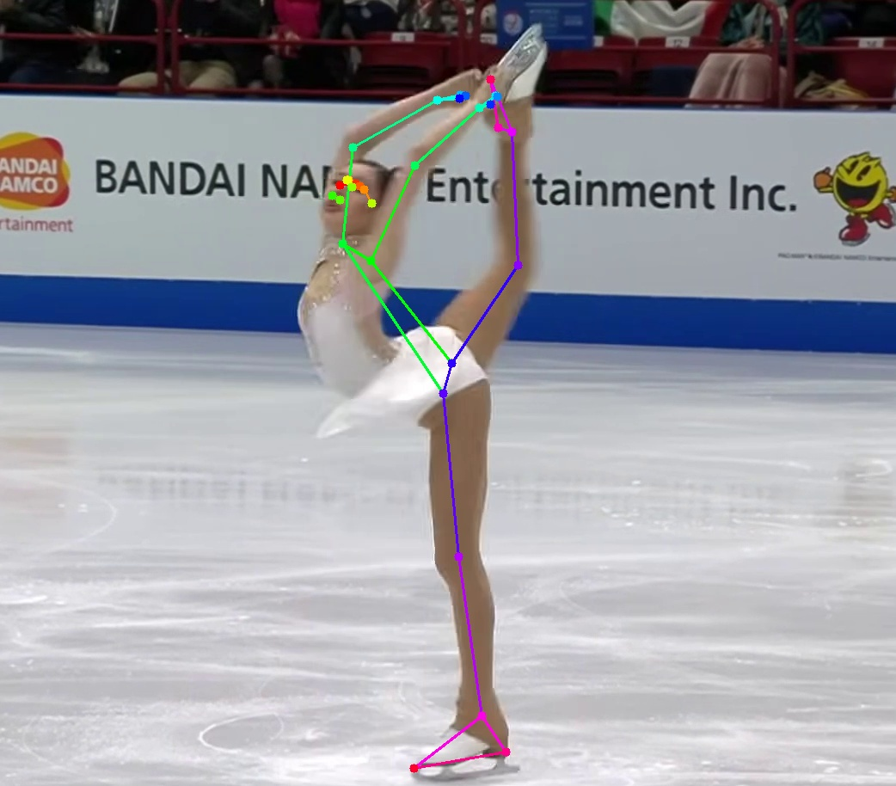
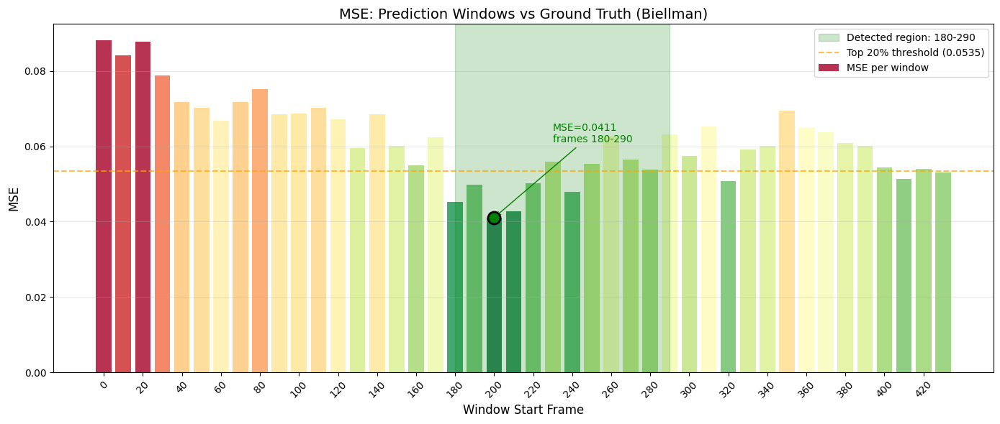

# Skate Pose — Biellmann Spin Detection

Detect a specific figure-skating move (the **Biellmann spin** for example) inside an skating
video by comparing pose-landmark trajectories of the target clip against a labelled
ground-truth reference using a sliding-window MSE search.


The green banner appears on frames where the algorithm detects the Biellmann spin.


## Motivation

Figure skating judging relies entirely on human judges, making scoring subjective and there are many times inconsistencies in judging.
The long-term goal is to automate the technical panel. They are the officials responsible for identifying and listing every element a skater performs. That process should be consistent and objective. A model must reliably identify which elements a skater is performing in order to this. I focused on the biellman spin for this project.


---

## How it works

1. **Frame extraction** — input video is split into per-frame JPEGs.
2. **Pose estimation** — every frame is run through MediaPipe's
   `pose_landmarker_heavy.task` model to produce 33 body landmarks.
3. **Landmark tracks** — landmarks are aggregated across frames and exported as
   CSV / JSON.
4. **Sliding-window matching** (in [predict_biellman_movement.ipynb](predict_biellman_movement.ipynb)):
   - A reference window of the Biellmann spin is taken from the ground-truth video
     (frames 60–145).
   - The prediction video is scanned with a 90-frame window (step = 10 frames).
   - Each pose matrix is **normalised** (centered per-frame, scaled to [-1, 1]) so
     translation/scale of the skater do not affect the comparison.
   - **MSE** is computed between the ground-truth window and each candidate window.
   - The window with the lowest MSE is reported as the detected Biellmann segment.
5. **Visualisation** — frames inside the detected range are overlaid with a green
   banner and the result is muxed into [biellman_detected_result.mp4](biellman_detected_result.mp4).

   


## MSE matching graph



Each bar represents a 90-frame sliding window over the prediction video. The colour scale runs from red (high MSE, poor match) to green (low MSE, close match). The **orange dashed line** is the top-20% MSE threshold — windows below it are considered candidate detections. The **green shaded region** marks the detected Biellmann segment: it starts at the first window that crosses below the threshold (frame 180) and ends at the last frame of the best-matching window (frame 290). The dot with the annotation marks the single window with the lowest MSE.


## Setup

```bash
python -m venv .venv
source .venv/bin/activate
pip install mediapipe opencv-python numpy pandas matplotlib jupyter
```

The MediaPipe model (`pose_landmarker_heavy.task`) is downloaded automatically by
the pipeline if it is not already present.

---

## Usage

### 1. Run the pose pipeline on a video

```bash
python -m src.main path/to/your_video.mp4
```

This produces, under `prediction_data/`:

- `prediction_frames/` — raw frames
- `prediction_frames_pose/` — frames annotated with skeletons
- `prediction_landmark_tracks/landmark_tracks.{csv,json}` — landmark trajectories

(Run the same pipeline on your reference clip to populate `ground_truth/`.)

### 2. Detect the Biellmann spin

Open [predict_biellman_movement.ipynb](predict_biellman_movement.ipynb) and run all
cells. The notebook will:

- Build the ground-truth pose matrix from the frames.
- Slide a 90-frame window across the prediction video.
- Plot per-window MSE and highlight the best match.
- Render the video with a green overlay on detected frames.

---
---

## Repository layout

```
.
├── pose_landmarker_heavy.task          # MediaPipe pose model
├── predict_biellman_movement.ipynb     # Detection notebook (sliding-window MSE)
├── biellman_detected_result.mp4        # Output video with detection overlay
├── assets/
│   └── biellman_detected_result.gif    # Demo GIF used in this README
│
├── src/                                # Pipeline (frames → pose → tracks)
│   ├── config.py                       #   paths & constants
│   ├── split_video.py                  #   1) video → frames
│   ├── batch_pose_estimation.py        #   2) frames → annotated pose frames
│   ├── extract_landmark_tracks.py      #   3) frames → landmark CSV/JSON
│   └── main.py                         #   end-to-end runner
│
├── utils/                              # Lower-level helpers + standalone scripts
│
├── ground_truth/                       # Reference clip (Biellmann at frames 60–145)
│   ├── frames/
│   ├── frames_pose/
│   └── landmark_tracks/
│
├── landmark_tracks/                    # Tracks for the reference video
│
└── prediction_data/                    # Target clip to search
    ├── prediction_frames/
    ├── prediction_frames_pose/
    └── prediction_landmark_tracks/
```

---


## Notes & limitations
- Need to manually Adjust the groundtruth frames in notebook.
- Per-frame normalisation removes translation and global scale but **not**
  rotation — sequences shot from very different camera angles may not match well.
- Detection is template-based: it finds the window whose normalised pose matrix
  is **closest** to the reference. It does not yet score whether the match is
  good in an absolute sense — every video will produce *some* "best" window.
  A threshold on MSE (or top-k filtering) is recommended before treating a
  detection as positive.
